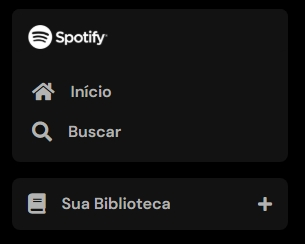
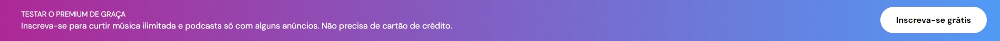
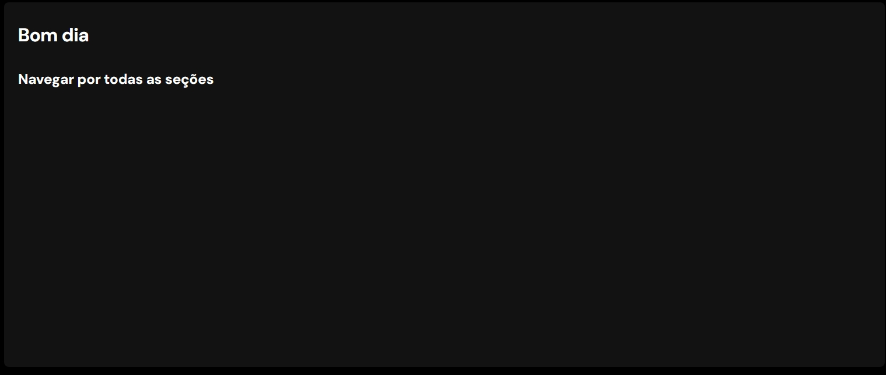

# Imersão Front-end - Alura
Repositório dedicado ao projeto feito durante a 2º edição da Imersão Front-End da Alura
 
## 1º aula Revisão: HTML, CSS e JS na Prática
📝  Nesta aula aprendi sobre estes conteúdos: 
- Entrar no VSCode;
- Compreender as diferenças entre HTML, CSS e JavaScript;
- Fazer a sidebar navigation;
- Aprender dicas de atalho no VSCode para escrever HTML;
- Introduzir as propriedades de estilo do CSS no projeto, com truques no Devtools;

### Desafio aula 01 ✅
Construir a aba “Sua biblioteca” 

## 2º aula Estilo Avançado e Posicionamento: Transformando Layouts

📝  Nesta aula aprendi: 
- Criar todo menu lateral da página;
- Aprender os fundamentos do CSS Flexbox;
- Saber mais sobre posicionamentos no CSS;

### Desafio aula 02 ✅
Fazer a tag footer (brinque com o botão, faça o gradiente, etc).

## 3º aula Layout Flexbox, Pseudo-classes e Responsividade em CSS

📝 Nesta aula aprendi: 
- Estruturar melhor o projeto;
- Refatorar o código;
- Fazer o layout flexbox;
- Aprender conceitos de responsividade;
- Criar o menu superior;

### Desafio aula 03 ✅
Fazer os cards de “Boa tarde” e “Navegar por todas as seções”.

## 4º aula CSS Grid, Media Queries e Manipulação do DOM com JavaScript

📝 Nesta aula aprendi: 
- Criar os cards da página inicial;
- Aprender a usar o CSS Grid Layout;
- Utilizar media queries para responsividade;
- Instalar do Node.js;
- Introduzir o JavaScript no projeto;
- Utilizar o conceito DOM;
- Conhecer o método Promises do JavaScript;
- Desafios: fazer mais cards se baseando na página do Spotify.

## 5º aula Frameworks e Eficiência: Introdução ao React e Angular

📝 Nesta aula aprendi: 
- Usar framework React;
- Criar o componente <Header> utilizando o React.

